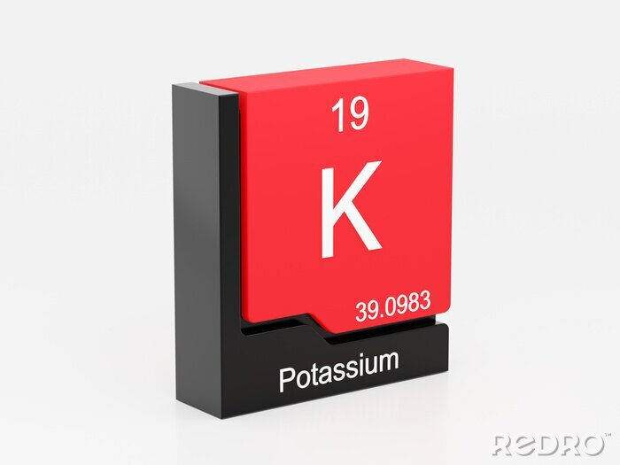

# Potassium

Potassium is a fork of Embeddium, which itself is a fork of Sodium.
Potassium is specifically designed to improve performance on older and low-end PCs (especially 2010–2013 hardware), by using more aggressive defaults and optional “Old PC” rendering optimizations. 
## Highlights

* All performance improvements from Sodium 0.5.8 and earlier, i.e. a rewritten terrain renderer, various optimizations to the immediate-mode rendering pipeline (used by entities, GUIs, block entities, etc.), and other miscellaneous improvements
* Available for Minecraft Forge on 1.20.1 and older, and Fabric/NeoForge on 1.20.1 and newer
* Integrated Fabric Rendering API support (Indium is no longer required, and will not work with Embeddium)
* Frequent patch updates to fix mod compatibility issues soon after being reported & reproduced
* Additional APIs for mod integration
* Optional support for translucency sorting (can be enabled in Video Settings)

## For developers

If you're looking to add Embeddium to your development environment, please take a look at the [dedicated wiki page](https://github.com/FiniteReality/embeddium/wiki/For-Developers) for instructions & recommended guidelines for integration.

## Credits

* JellySquid & the CaffeineMC team, for making Sodium in the first place, without which this project would not be possible
* All Embeddium developers for modyfing Sodium for Forge

## License

Embeddium is licensed under the Lesser GNU General Public License version 3.

Portions of the option screen code are based on Reese's Sodium Options by FlashyReese, and are used under the terms of
the [MIT license](https://opensource.org/license/mit), located in `src/main/resources/licenses/rso.txt`. 
